# Noughts and Crosses
## Introduction
I have created a Noughts and Crosses game which has the option to play a two player game or to play against the computer. 

The idea of the game is to get 3 O's or 3 X's in a row either horizontally, vertically or diagonally.

I have created an opening page where you choose which game type you would like to play.

Each game has a home button to return back to the main page.

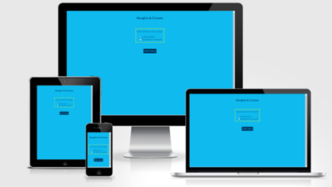

## Features 

Main page at 320px 

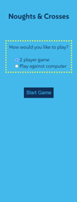

Main page at 786px 

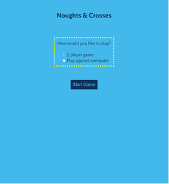

Main page at 1042px

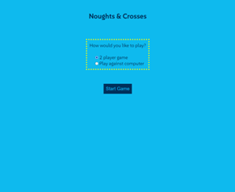

Main Page at 1440px

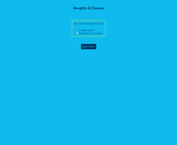

I chose Background color rgb (14,186,238) for the pages in the game. This is a nice vibrant light blue color.

I chose Color hsl (208, 100%, 18%) for the text which is a dark blue that stands out well against the light blue background.

I also added a dotted border around the game-type div and choose a yellow color for this, as a contrast to the blue.

The game-type area is where the choices are to choose which game you want to play.

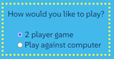

Underneath the game-type area is the start game button.

Here I used the dark blue color hsl (208, 100%, 18%) for the background and the light blue color rgb (14, 186, 238) for the text, in contract to the page colors so that this stands out well.

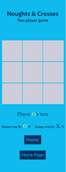

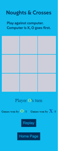

Game Board Area

For the game grid I used Background color rgb (206, 206, 218) which is a light grey colour which goes nicely with the blue and yellow colors already choosen.

Border color rgb (14, 186, 238). This is the same as the page background color so it gives the effect of gaps between the boxes.

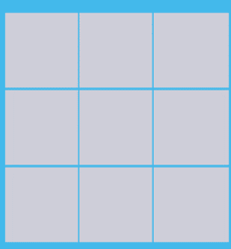

Players area

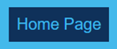

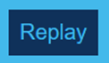

### Existing Features

### Features Left to Implement

## Testing 

### Validator Testing 

### Unfixed Bugs

## Deployment

## Credits 

### Content 

### Media

## Other General Project Advice

Below you will find a couple of extra tips that may be helpful when completing your project. Remember that each of these projects will become part of your final portfolio so it’s important to allow enough time to showcase your best work! 

- One of the most basic elements of keeping a healthy commit history is with the commit message. When getting started with your project, read through [this article](https://chris.beams.io/posts/git-commit/) by Chris Beams on How to Write  a Git Commit Message 
  - Make sure to keep the messages in the imperative mood 

- When naming the files in your project directory, make sure to consider meaningful naming of files, point to specific names and sections of content.
  - For example, instead of naming an image used ‘image1.png’ consider naming it ‘landing_page_img.png’. This will ensure that there are clear file paths kept. 

- Do some extra research on good and bad coding practices, there are a handful of useful articles to read, consider reviewing the following list when getting started:
  - [Writing Your Best Code](https://learn.shayhowe.com/html-css/writing-your-best-code/)
  - [HTML & CSS Coding Best Practices](https://medium.com/@inceptiondj.info/html-css-coding-best-practice-fadb9870a00f)
  - [Google HTML/CSS Style Guide](https://google.github.io/styleguide/htmlcssguide.html#General)

Getting started with your Portfolio Projects can be daunting, planning your project can make it a lot easier to tackle, take small steps to reach the final outcome and enjoy the process! 

[def]: assets/images/.png