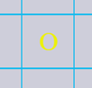
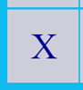
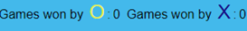
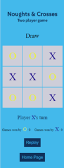
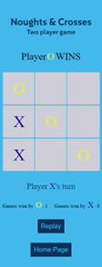
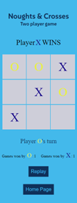
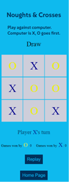
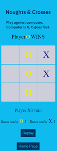
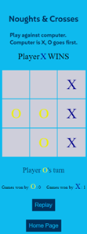
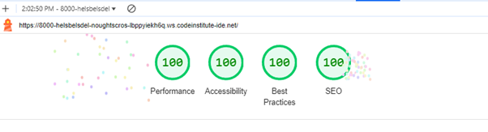

# Noughts and Crosses
## Introduction
I have created a Noughts and Crosses game which has the option to play a two player game or to play against the computer. 

The idea of the game is to get 3 O's or 3 X's in a row either horizontally, vertically or diagonally.

I have created an opening page where you choose which game type you would like to play.

Each game has a home button to return back to the main page.

## Features 

Main page at 320px 

Main page at 786px 

Main page at 1042px

Main Page at 1440px

I chose Background color rgb (14,186,238) for the pages in the game. This is a nice vibrant light blue color.

I chose Color hsl (208, 100%, 18%) for the text which is a dark blue that stands out well against the light blue background.

I also added a dotted border around the game-type div and choose a yellow color for this, as a contrast to the blue.

The game-type area is where the choices are to choose which game you want to play.

Underneath the game-type area is the start game button.

Here I used the dark blue color hsl (208, 100%, 18%) for the background, in contract to the page colors so that this stands out well. For the text on the game button I chose the light blue color rgb (14, 186, 238) which is the same color as the page background.

Two Player Game Start Page

Play Against the Computer Start Page

Game Board Area

For the game grid I used Background color rgb (206, 206, 218) which is a light grey colour which goes nicely with the blue and yellow colors already choosen.

Border color rgb (14, 186, 238). This is the same as the page background color so it gives the effect of gaps between the boxes.

Nought always goes first. I chose yellow for the nought icon. This stands out against the grey background.

I chose dadrk blue for the X icon. This also stands out against the grey background and is in keeping with the other text color.

Underneath the game grid is the palyers area, where it tells you whoes turn it is.
Players area

Underneath the players area is a score tally detailing how many games have been won by O and X.
This values increase by 1 as each player wins a game.

Underneath the score tally is a replay button. When the user clicks on this button, the game grid resets to zero.
The score tally keeps score until the home page button is clicked.

The home page buttn is underneath the replay button and this takes the user back to the home page where they can switch game type or start a fresh game of the same type they have been playing.

Winning scenarios for each game type

Two Player Game - Draw

Two Player Game - O Wins

Two Player Game - X Wns

Play Against Computer - Draw

Play Against Computer - O Wins

Play Against Computer - X Wins

### Features Left to Implement

Currently in the play against computer game, the computer chooses its go by random. My plan would be to update this to a more sophisticated system where the computer move is more educated.

## Testing 

I have tested all the buttons and results of the games. I have made sure that the game resets one the home button has been clicked.
The game is responsive and looks good on all screen sizes and also looks good on differetn web browsers.

### Validator Testing 

I ran my html code through the html validator and got no errors. 
I also ran my css code through the css validator and got no errors.
I ran my JavaScript code throught the JavaScript hint validator and got no errors.
I ran the lighthouse tester and got good results.

## Deployment

To deploy my project, I went to my Github repository and in the settings tab, I selected the master branch and waited for my project to be deployed.
Here is the link : https://helsbels-del.github.io/Noughts-Crosses/ 

## Credits 

Create a simple tic tac toe game using HTML, CSS, JavaScript (youtube.com)

https://lemmoscripts.com/wp/2018/09/03/creating-a-simple-tic-tac-toe-or-naughts-and-crosses-game-in-javascript-and-jquery/#fncomputermove

